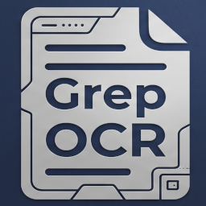

<p align="center">
  
</p>

<h1 align="center">PDF OCR to Markdown</h1>

<p align="center">
  A desktop app for Windows and Linux that turns scanned PDFs into searchable PDFs and clean Markdown files, fully offline.
</p>

---

## Overview

PDF OCR to Markdown reads scanned or image-based PDF files, recognizes the text with Tesseract OCR, and saves:

- **A searchable PDF:** the original pages, unchanged, with an invisible text layer added. The file stays close to the original size.
- **A Markdown file (optional):** structured text with headings and lists, ready to use with AI assistants such as Claude, or in documentation tools.

All processing runs locally on your computer. No document is uploaded anywhere.

## Features

- Runs on **Windows** and **Linux**, as a single portable app with no installation, no Python, and no admin rights required.
- Arabic and English text recognition, including mixed-language pages, with correct Arabic word order in the Markdown output.
- Batch processing of individual files or whole folders.
- Page range selection, for example `1-5, 9`.
- Automatic skipping of pages that already contain text.
- Three scan-quality levels: Compact (200 dpi), Standard (300 dpi), and Small print (400 dpi).
- Safe handling of large-format drawings (A0/A1) through automatic resolution limits.
- Optional page markers and header/footer removal in the Markdown output.
- Built-in form to report a bug or suggest an improvement.

## Download

Open the **[Releases](../../releases)** page and download the package for your system from the latest release:

| System | Package |
|---|---|
| Windows 10 or 11 (64-bit) | `PDF-OCR-v<version>-Windows.zip` |
| Linux (64-bit) | `PDF-OCR-v<version>-Linux.tar.gz` |

### Windows

1. Extract the ZIP file.
2. Double-click `PDF-OCR.exe`.

If Windows SmartScreen shows "Windows protected your PC," select **More info**, then **Run anyway**.

### Linux

```bash
tar -xzf PDF-OCR-v<version>-Linux.tar.gz
cd PDF-OCR-v<version>-Linux
./install_linux.sh
```

The installer adds **PDF OCR to Markdown** to your applications menu and the `pdf-ocr` command, for the current user only (no `sudo`). To run the app without installing, use `./PDF-OCR`. To remove it, run `./install_linux.sh --uninstall`.

The Linux build runs on Ubuntu 22.04, Linux Mint 21, Debian 12, Fedora 38, and newer distributions with a desktop environment.

## Usage

1. Select **Add files…** or **Add folder…**, and choose your PDFs.
2. Adjust the options if needed: document language, scan quality, page range, and output folder.
3. Select **Run OCR**.
4. When OCR finishes, select **Convert to Markdown** if you need the `.md` files.

Outputs are saved next to each original PDF unless you choose another folder:

| Output | Description |
|---|---|
| `<name>_ocr.pdf` | Searchable PDF |
| `<name>.md` | Markdown text |

The app unpacks itself each time it starts, so the window may take several seconds to appear.

## Build from Source

### Requirements

| | Windows | Linux (Debian, Ubuntu, Linux Mint) |
|---|---|---|
| Python | 3.10 or later from [python.org](https://www.python.org/downloads/) (per-user install, no admin rights needed) | `sudo apt install python3 python3-venv python3-tk` |
| Editor (recommended) | Visual Studio Code with the Python extension | Same |

On other distributions, install Python 3.10 or later with its `venv` and Tkinter packages.

### Build in VS Code (Windows and Linux)

1. Clone or download this repository and open its folder in VS Code (**File > Open Folder**).
2. Select **Terminal > Run Task…** and run the tasks in order:

   | Task | Purpose |
   |---|---|
   | `1. Create environment` | Creates the `.build-venv` Python environment |
   | `2. Install packages` | Installs the dependencies |
   | `3. Test app` | Downloads the OCR language data if needed, then runs the app from source |
   | `4. Build EXE` | Builds `dist/PDF-OCR.exe` (Windows) or `dist/PDF-OCR` (Linux) |
   | `5. Package release` | Builds and creates a ready-to-share archive in `release/` |

Each system builds only its own version. To build both, use the GitHub workflow below, or run the tasks on each system.

### Build from the Command Line

**Windows (PowerShell):**

```powershell
python -m venv .build-venv
.build-venv\Scripts\python.exe -m pip install -r requirements.txt pyinstaller pillow
.build-venv\Scripts\python.exe build_exe.py --package
```

**Linux:**

```bash
python3 -m venv .build-venv
.build-venv/bin/python -m pip install -r requirements.txt pyinstaller pillow
.build-venv/bin/python build_exe.py --package
```

`build_exe.py` downloads the OCR language data (`eng`, `ara`) during the first build. If the download is blocked, download `eng.traineddata` and `ara.traineddata` from [tessdata_best](https://github.com/tesseract-ocr/tessdata_best) in a browser and save them in a `tessdata` folder in the project.

### Automatic Builds on GitHub

`.github/workflows/release.yml` builds both versions on GitHub:

- **Publishing a release** builds the Windows and Linux packages and attaches them to that release automatically.
- **Running the workflow manually** (Actions tab > **Build release** > **Run workflow**) creates test builds, available under the run's **Artifacts**.

### Project Structure

```
├── .github/workflows/release.yml   Windows and Linux builds on GitHub
├── .vscode/                        VS Code tasks and settings (Windows and Linux)
├── app_icon.png                    App icon
├── build_exe.py                    Build and packaging script
├── install_linux.sh                Linux menu installer (included in the Linux package)
├── pdf_ocr_standalone.py           Application source code
├── READ_ME_FIRST.txt               User guide (included in the release packages)
├── requirements.txt                Python dependencies
├── CHANGELOG.md
├── LICENSE
└── THIRD_PARTY_NOTICES.md
```

## Known Limitations

- Tables in scanned pages are converted as text rows, not as Markdown tables.
- OCR accuracy depends on scan quality. Handwriting, stamps, and signatures are recognized poorly.
- Arabic file names may display with reversed letter order in the app window on Linux. Processing is not affected.
- Languages other than Arabic and English require additional language data and a code change.

## Contributing

Contributions are welcome:

- **Bug reports and suggestions:** Use the **Report a bug or suggest an improvement** button in the app, or open an [issue](../../issues).
- **Code changes:** Fork the repository, make your changes, and open a pull request with a short description of what changed and why. If possible, test on both Windows and Linux.

Under the AGPL-3.0 license, modified versions that you share must also be published under AGPL-3.0, with the original copyright notice kept.

## License

Copyright © 2026 A.T.Grep

This program is free software: you can redistribute it and/or modify it under the terms of the GNU Affero General Public License as published by the Free Software Foundation, version 3. See [LICENSE](LICENSE) for the full text.

This program is distributed in the hope that it will be useful, but **without any warranty**, without even the implied warranty of merchantability or fitness for a particular purpose.

The app includes third-party components under their own licenses. See [THIRD_PARTY_NOTICES.md](THIRD_PARTY_NOTICES.md).
